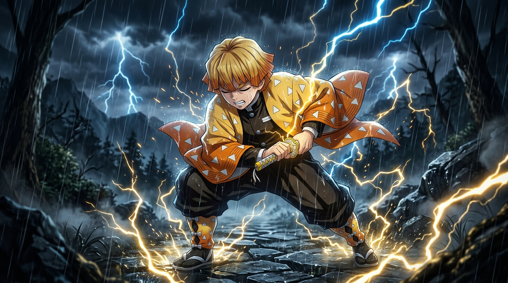
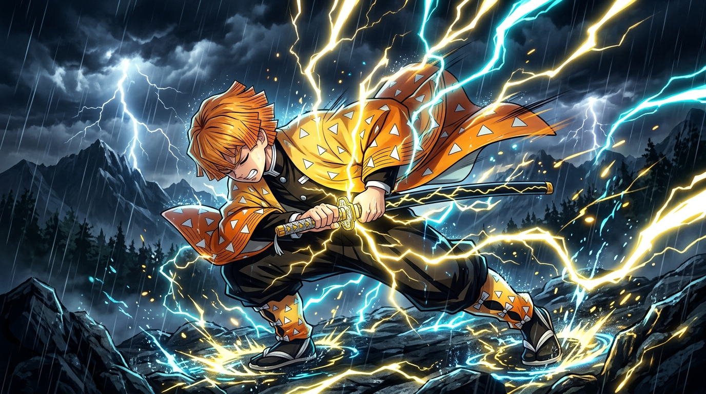
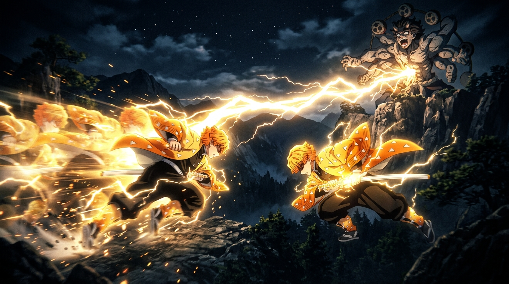

<div align="center">

# ⚡ ZENITSU AGATSUMA
### THE SOUND OF THUNDER — MINIMAL CINEMATIC PORTFOLIO

<p align="center">
  
</p>

[](https://zenitsu-kohl.vercel.app)
[](https://github.com/codexanjan/Zenitsu/stargazers)
[](https://github.com/codexanjan/Zenitsu/network/members)
[](https://github.com/codexanjan/Zenitsu/actions)
[](https://react.dev)
[](https://www.typescriptlang.org)
[](https://tailwindcss.com)
[](https://developer.mozilla.org/en-US/docs/Web/API/Web_Audio_API)
[](LICENSE)

<br />

**"Master one thing. Hone it to the utmost limit."**  
*— Jigoro Kuwajima to Zenitsu Agatsuma*

<br />

### 🌐 [EXPLORE LIVE PRODUCTION WEBSITE](https://zenitsu-kohl.vercel.app)

**Built with ❤️ by [Anjan Shetty](https://github.com/codexanjan)**  
[](https://twitter.com/intent/tweet?text=Check%20out%20this%20insane%20Zenitsu%20Agatsuma%20cinematic%20portfolio%20with%20procedural%20lightning%20and%20audio!%20https://zenitsu-kohl.vercel.app%20built%20by%20@codexanjan)

---

</div>

## 📑 Table of Contents
- [🌌 The Concept](#-the-concept)
- [⚡ Groundbreaking Features](#-groundbreaking-features)
  - [1. ⚡ Thunder Mode Overdrive](#1--thunder-mode-overdrive)
  - [2. 🗡️ Interactive Iaido Drag-to-Slash Blade Mechanic](#2-️-interactive-iaido-drag-to-slash-blade-mechanic)
  - [3. ⏱️ Godspeed Reaction Reflex Challenge](#3-️-godspeed-reaction-reflex-challenge-viral-mini-game)
  - [4. 💤 Dual Mental State Switcher](#4--dual-mental-state-switcher-asleep-god--fearful-boy)
  - [5. 📜 8-Chapter Animated Storyline](#5--8-chapter-animated-storyline)
  - [6. ⚡ 5 Masterwork Techniques](#6--5-masterwork-techniques)
  - [7. ⛩️ Archives of Lightning](#7-️-archives-of-lightning-lore-section)
  - [8. 🎬 Climax Video Cutscene](#8--climax-video-cutscene--interactive-climax)
  - [9. 🖼️ Uniform 1:1 Symmetrical Gallery](#9-️-uniform-11-symmetrical-exhibition-gallery)
  - [10. 🎵 100% Procedural Web Audio API Synthesizer](#10--100-procedural-web-audio-api-sound-synthesizer)
- [🛠️ Tech Stack](#-tech-stack)
- [📂 Project Architecture](#-project-architecture)
- [🚀 Quick Start](#-quick-start)
- [🎮 Interactive Controls & Shortcuts](#-interactive-controls--shortcuts)
- [⭐ Star History](#-star-history)
- [🤝 Contributing](#-contributing)
- [📜 Legal Disclaimer](#-legal-disclaimer)
- [👤 Author](#-author)

---

## 🌌 The Concept

**MINIMAL INTERFACE. MAXIMUM CINEMATIC STORYTELLING.**

This website reimagines how an anime character experience can feel on the web. Rather than a cluttered fan wiki or a generic game UI, this is an ultra-premium, luxury animated character portfolio dedicated to **Zenitsu Agatsuma** from *Demon Slayer: Kimetsu no Yaiba*.

Every interaction, sound, particle, and lightning strike is choreographed to honor Zenitsu’s emotional transformation from a terrified, weeping boy into an unstoppable, divine god of lightning.

---

## ⚡ Groundbreaking Features

### 1. ⚡ Thunder Mode Overdrive
Clicking **"THUNDER MODE"** triggers a full-system transformation:
- **Screen Shockwave Recoil & Flash**: A violent screen-shake and blinding white-gold lightning strike across the sky.
- **Electrified Viewport Perimeter**: 4 animated plasma border arcs continuously dance around the edges of the screen.
- **Cyberpunk Anime Overdrive HUD**: A floating glass badge in the top-right displaying real-time voltage (`⚡ 9,999,999 V`), live audio-reactive visualizer bars, and a **`STRIKE`** button to discharge manual lightning bolts on command.
- **Electrified Tesla Cursor**: Golden aura and orbiting sparks trail your desktop pointer.

---

### 2. 🗡️ Interactive Iaido Drag-to-Slash Blade Mechanic
- **Drag or swipe anywhere across the screen** (desktop mouse or mobile touchscreen) to unsheathe Zenitsu’s Nichirin blade!
- A golden lightning cutting line with real-time electrical sparks follows your pointer.
- Releasing triggers a supersonic sword draw with **metallic slicing sound effects, thunder crack, spark explosion, and a fading plasma cut across the page**.

---

### 3. ⏱️ Godspeed Reaction Reflex Challenge (Viral Mini-Game)
- Click **"TEST REFLEXES"** in the Hero section to test your neurological speed against Thunder Breathing:
  - Screen turns pitch black with steady falling rain.
  - Sudden blinding white flash and thunder strike!
  - Click as fast as humanly possible to measure your reaction time in milliseconds (`ms`).
- **Rankings**:
  - `⚡ < 170ms`: **GODSPEED RANK** *(Beyond human cognitive limits)*
  - `🗡️ < 220ms`: **THUNDER HASHIRA** *(Master Kuwajima's Successor)*
  - `⚔️ < 290ms`: **CORPS TSUGUKO** *(First Form Master)*
  - `🏃 > 290ms`: **PANICKED ZENITSU** *(“Run away right now!”)*
- Includes a 1-click **"SHARE SCORE"** button for viral social media sharing!

---

### 4. 💤 Dual Mental State Switcher (Asleep God ↔ Fearful Boy)
- Directly in the Hero section, toggle between Zenitsu’s two psychological realities:
  - 💤 **STATE: ASLEEP (THUNDER GOD)**: Incandescent golden lighting, electric eyes, divine thunder hum.
  - 😰 **STATE: CONSCIOUS (FEARFUL BOY)**: Desaturated rain, crying vulnerability, and gentle heartbeat.

---

### 5. 📜 8-Chapter Animated Storyline
Scroll through Zenitsu’s journey with a sticky side chapter indicator (`01`–`08`):
1. **01. FEAR** — Vulnerability, tears, and slumbering subconscious potential.
2. **02. TRAINING WITH JIGORO** — Mount Hanatate peach blossoms, forging a single strike.
3. **03. THUNDER BREATHING** — Supersonic acceleration and lower body biomechanics.
4. **04. FRIENDSHIP** — Protecting Nezuko's wooden box at the Wisteria estate.
5. **05. GROWTH** — Overcoming cowardice with quiet, steadfast resolution.
6. **06. AWAKENING** — The eyes close, subconscious trance takes over.
7. **07. GODSPEED** — Time dilation, frozen raindrops, heartbeat tension, reality-tearing slash.
8. **08. COURAGE** — *"Courage does not mean having no fear. It means moving forward despite it."*

---

### 6. ⚡ 5 Masterwork Techniques
Full-screen interactive panels with attack statistics and live **`ACTIVATE TECHNIQUE`** buttons:
- **First Form: Thunderclap & Flash** (*Ichi no kata: Hekireki Issen*)
- **Sixfold** (*Rokuren*) — 6 rapid zigzag afterimage rebounds
- **Eightfold** (*Hachiren*) — 8 concurrent omnidirectional strikes
- **Godspeed** (*Shinsoku*) — Supersonic warp dash exceeding demonic cognition
- **Seventh Form: Flaming Thunder God** (*Honoikazuchi no Kami*) — Zenitsu’s original self-created celestial dragon strike!

<p align="center">
  
  
</p>

---

### 7. ⛩️ Archives of Lightning (Lore Section)
- **Superhuman Hearing Spectrum (超絶聴覚)**: Interactive waveform visualizer reading Emotional Resonance, Demonic Dissonance, Heartbeat Truth, and Unconscious Trance with sound feedback.
- **The Nichirin Katana Anatomy**: The yellow lightning-hamon blade forged from Mount Yoko's Scarlet Crimson Iron Sand & four-leaf clover tsuba.
- **Ukogi (Chuntaro)**: Interactive chirp action and lore of Zenitsu's faithful sparrow companion.

---

### 8. 🎬 Climax Video Cutscene & Interactive Climax
- 16:9 cinematic video player embedded in the Finale with anime scene cuts, speed lines, camera pushes, and synchronized audio.
- Theatrical sequence: *"THUNDER BREATHING... FIRST FORM... THUNDERCLAP & FLASH"* with an interactive **UNLEASH** strike and story replay!

---

### 9. 🖼️ Uniform 1:1 Symmetrical Exhibition Gallery
- Perfectly square (`aspect-square` 1:1) luxury grid layout.
- Curated 9-item high-resolution photography archive with full-screen dark lightbox modal (Next/Prev/Esc controls).

---

### 10. 🎵 100% Procedural Web Audio API Sound Synthesizer
- Zero broken MP3 files: every sound is synthesized dynamically in real time:
  - Ambient rainfall (pink noise bandpass filter)
  - Distant rolling thunder (40Hz sub-bass resonant decay)
  - High-voltage electrical hum
  - Nichirin blade draw and metallic chiming ring
  - Dual physiological heartbeats
  - Thunderclap transient cracks

---

## 🛠️ Tech Stack

| Technology | Purpose |
| :--- | :--- |
| **React 19** | Component architecture & state management |
| **TypeScript** | Strict type safety and module syntax |
| **Vite 8** | Sub-second lightning-fast build tooling |
| **Tailwind CSS v4** | Modern theme tokens, fluid typography & utility styling |
| **HTML5 Canvas 2D API** | Procedural lightning branching, depth rain, sparks & blade slashes |
| **Web Audio API** | Real-time procedural sound synthesizer engine |
| **Lucide React** | Minimalist modern iconography |
| **Vercel** | Global edge production hosting |

---

## 📂 Project Architecture

```text
Zenitsu/
├── .github/
│   ├── ISSUE_TEMPLATE/
│   │   ├── bug_report.md
│   │   └── feature_request.md
│   └── workflows/
│       └── ci.yml             # GitHub Actions CI build & lint
├── public/
│   ├── favicon.svg            # Thunder lightning favicon
│   └── icons.svg
├── src/
│   ├── assets/
│   │   └── zenitsu/
│   │       ├── hero/          # Desktop (16:9) & Mobile (9:16)
│   │       ├── portrait/      # Editorial 2:3 Character Portrait
│   │       ├── story/         # 8 Story Chapter visuals (Ch 01 - Ch 08)
│   │       ├── techniques/    # 5 Technique action panels
│   │       ├── gallery/       # 9 Uniform 1:1 Exhibition items
│   │       └── finale/        # Climax silhouette artwork
│   ├── audio/
│   │   └── SoundEngine.ts     # Procedural Web Audio synthesizer
│   ├── components/
│   │   ├── common/
│   │   │   └── AnimeImage.tsx # Responsive image loader with blur placeholder
│   │   ├── effects/
│   │   │   ├── CustomCursor.tsx    # Electric yellow cursor & Tesla aura
│   │   │   ├── GlobalCanvas.tsx    # Procedural branching lightning & rain
│   │   │   ├── GodspeedReflex.tsx  # Reaction speed challenge mini-game
│   │   │   ├── IaidoSlash.tsx      # Drag-to-slash blade mechanic
│   │   │   ├── SlashOverlay.tsx    # Full-screen technique choreography
│   │   │   └── ThunderOverdrive.tsx# Electrified perimeter & Cyberpunk HUD
│   │   ├── layout/
│   │   │   ├── Footer.tsx     # Author credit, disclaimer, sound toggle
│   │   │   └── Navbar.tsx     # Glassmorphic nav with sound & mode toggles
│   │   └── sections/
│   │       ├── About.tsx      # Editorial profile & 4 combat meters
│   │       ├── ClimaxVideo.tsx# 16:9 Animated climax video player
│   │       ├── Finale.tsx     # Climax invocation & replay
│   │       ├── Gallery.tsx    # 1:1 Symmetrical gallery & lightbox
│   │       ├── Hero.tsx       # Cinematic hero with mental state switcher
│   │       ├── Lore.tsx       # Hearing visualizer, Katana, Ukogi
│   │       ├── Storyline.tsx  # 8 scroll-driven narrative chapters
│   │       └── Techniques.tsx # 5 interactive technique panels
│   ├── App.tsx                # Master experience controller
│   ├── index.css              # Custom design system & animations
│   └── main.tsx               # Root entrypoint
├── CODE_OF_CONDUCT.md         # Community code of conduct
├── CONTRIBUTING.md            # Guidelines for open source contributors
├── LICENSE                    # MIT License
├── package.json
└── vite.config.ts
```

---

## 🚀 Quick Start

### Prerequisites
- [Node.js](https://nodejs.org/) (v18 or higher recommended)
- [npm](https://www.npmjs.com/)

### Installation

```bash
# Clone the repository
git clone https://github.com/codexanjan/Zenitsu.git

# Enter the project directory
cd Zenitsu

# Install dependencies
npm install

# Start development server
npm run dev
```

Visit `http://localhost:5173` in your browser to experience the website locally.

### Production Build

```bash
npm run build
npm run preview
```

---

## 🎮 Interactive Controls & Shortcuts

| Action | Control |
| :--- | :--- |
| **Unsheathe Blade** | Click & drag (or touch & swipe) anywhere on the screen |
| **Thunder Mode** | Click `THUNDER MODE` button in the Hero or Navbar |
| **Reflex Challenge** | Click `TEST REFLEXES` in the Hero |
| **Mental State** | Click `STATE: ASLEEP / CONSCIOUS` pill in the Hero |
| **Technique Motion** | Click `ACTIVATE TECHNIQUE` on any form |
| **Gallery Lightbox** | Click any image (`Esc` to close, `←` / `→` arrows to navigate) |
| **Sound Toggle** | Click `AUDIO / MUTED` pill in the Navbar |

---

## ⭐ Star History

<div align="center">
  <a href="https://star-history.com/#codexanjan/Zenitsu&Date">
    <picture>
      <source media="(prefers-color-scheme: dark)" srcset="https://api.star-history.com/svg?repos=codexanjan/Zenitsu&type=Date&theme=dark" />
      <source media="(prefers-color-scheme: light)" srcset="https://api.star-history.com/svg?repos=codexanjan/Zenitsu&type=Date" />
      
    </picture>
  </a>
</div>

---

## 🤝 Contributing

Contributions, issues, and feature requests are warmly welcomed!  
Feel free to check the [issues page](https://github.com/codexanjan/Zenitsu/issues) and read the [Contributing Guidelines](CONTRIBUTING.md).

1. Star ⭐ the repository!
2. Fork the Project
3. Create your Feature Branch (`git checkout -b feature/AmazingFeature`)
4. Commit your Changes (`git commit -m 'feat: add some AmazingFeature'`)
5. Push to the Branch (`git push origin feature/AmazingFeature`)
6. Open a Pull Request

---

## 📜 Legal Disclaimer

This is an **unofficial, non-commercial fan-made tribute website** created solely for artistic appreciation and web creative engineering showcase.

*Demon Slayer: Kimetsu no Yaiba* and all related characters, trademarks, and imagery are the intellectual property of **Koyoharu Gotouge / SHUEISHA / Aniplex / ufotable**.

---

## 👤 Author

**Anjan Shetty**
- **GitHub:** [@codexanjan](https://github.com/codexanjan)
- **Repository:** [codexanjan/Zenitsu](https://github.com/codexanjan/Zenitsu)
- **Live Demo:** [https://zenitsu-kohl.vercel.app](https://zenitsu-kohl.vercel.app)

---

<div align="center">
  <b>⚡ FORGED WITH LIGHTNING & DEDICATION ⚡</b>
</div>
